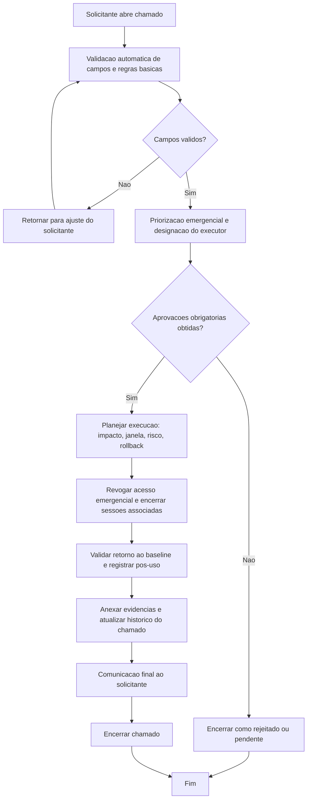

# BDSM - Revogacao de acesso emergencial (`bg-revoke`)

- Categoria: Breaking Glass AWS
- Fonte funcional: [ADR_REVOGACAO_BREAKING_GLASS_AWS.md](../adr/ADR_REVOGACAO_BREAKING_GLASS_AWS.md)

## 1. Objetivo do processo
Definir o fluxo proposto de execucao do chamado `bg-revoke` com controles de qualidade, governanca, seguranca e rastreabilidade.

## 2. Entradas do processo
### 2.1 Prerequisitos
- Incidente registrado e ativo
- Justificativa emergencial
- Aprovacao de seguranca

### 2.2 Campos obrigatorios da tela
- Conta AWS
- Ticket BG em Andamento
- Evidencia de Revogacao
- Justificativa Emergencial

### 2.3 Campos opcionais da tela
- Comentarios
- Upload de Anexos (opcional)

### 2.4 Documentos/evidencias esperadas
- Evidencia do incidente
- Plano de acao
- Justificativa emergencial

## 3. BDSM do processo proposto

## 4. Gates de controle para execucao
| Gate | Verificacao obrigatoria | Referencia da tela |
| --- | --- | --- |
| Gate 1 - Intake | Campos obrigatorios preenchidos | Conta AWS; Ticket BG em Andamento; Evidencia de Revogacao; Justificativa Emergencial |
| Gate 2 - Qualidade | Validacoes obrigatorias satisfeitas | Incidente obrigatorio; Justificativa obrigatoria; Conta AWS obrigatoria; Duracao maxima obrigatoria; Revisao pos-uso obrigatoria |
| Gate 3 - Governanca | Aprovacoes registradas | Gestor solicitante; Seguranca Cloud; Incident Response; CISO |
| Gate 4 - Execucao | Revogar acesso emergencial e encerrar sessoes associadas | Registrar evidencia objetiva de revogacao. |
| Gate 5 - Encerramento | Evidencias anexadas e comunicacao de conclusao | Historico do chamado atualizado + anexos + resultado final |

## 5. Boas praticas aplicaveis
- Executar validacao de completude e consistencia antes de iniciar qualquer acao tecnica.
- Aplicar principio do menor privilegio e segregacao de funcao durante aprovacao e execucao.
- Registrar evidencias tecnicas no chamado (logs, IDs, prints, diffs ou anexos).
- Atualizar status do chamado por etapa para manter rastreabilidade operacional.
- Confirmar dependencias e impacto antes da remocao/revogacao definitiva.
- Executar desativacao gradativa quando aplicavel para reduzir risco operacional.
- Definir timebox, escopo minimo e monitoramento continuo durante todo o periodo emergencial.
- Executar revisao pos-uso obrigatoria com evidencias de revogacao e normalizacao.

## 6. Regras especificas da tela
- Registrar evidencia objetiva de revogacao.

## 7. Criterios de conclusao
- Todas as validacoes obrigatorias atendidas.
- Aprovacoes registradas conforme cadeia da categoria.
- Execucao tecnica concluida sem pendencias abertas.
- Evidencias anexadas e comunicacao final registrada no chamado.
