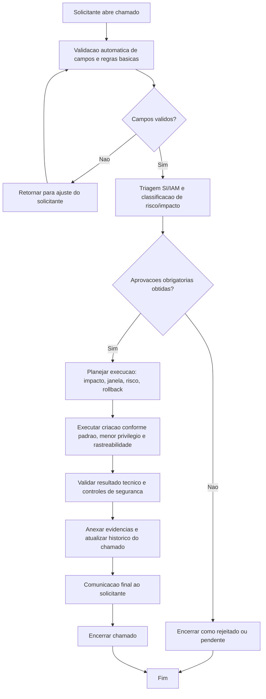

# BDSM - Criacao de usuario IAM (`iam-user-create`)

- Categoria: Usuarios IAM AWS
- Fonte funcional: [ADR_CRIACAO_USUARIO_IAM_AWS.md](../adr/ADR_CRIACAO_USUARIO_IAM_AWS.md)

## 1. Objetivo do processo
Definir o fluxo proposto de execucao do chamado `iam-user-create` com controles de qualidade, governanca, seguranca e rastreabilidade.

## 2. Entradas do processo
### 2.1 Prerequisitos
- Conta AWS ativa
- Justificativa de excecao para usuario local
- Owner tecnico definido

### 2.2 Campos obrigatorios da tela
- Conta AWS
- Usuario IAM (Taxonomia)
- Permissoes Iniciais do Usuario IAM
- Justificativa

### 2.3 Campos opcionais da tela
- Grupos IAM Existentes para Inclusao (quando aplicavel)
- Policies Existentes para Attach (quando aplicavel)
- Comentarios
- Upload de Anexos (opcional)

### 2.4 Documentos/evidencias esperadas
- Justificativa de negocio
- Escopo de permissoes
- Plano de desativacao (remocao)

## 3. BDSM do processo proposto

## 4. Gates de controle para execucao
| Gate | Verificacao obrigatoria | Referencia da tela |
| --- | --- | --- |
| Gate 1 - Intake | Campos obrigatorios preenchidos | Conta AWS; Usuario IAM (Taxonomia); Permissoes Iniciais do Usuario IAM; Justificativa |
| Gate 2 - Qualidade | Validacoes obrigatorias satisfeitas | Acesso de usuario de servico somente Programatico (sem console); Sem privilegio admin sem justificativa; Rotacao de access keys; Producao com aprovacao reforcada |
| Gate 3 - Governanca | Aprovacoes registradas | Gestor solicitante; Seguranca Cloud; IAM Admin |
| Gate 4 - Execucao | Executar criacao conforme padrao, menor privilegio e rastreabilidade | Usuario pessoal local nao faz parte do fluxo padrao.; Acesso de usuario de servico e implicito como Programatico (sem campo de tipo).; Permissoes iniciais podem ser: sem permissao, incluir em grupo existente, attach de policies existentes ou ambos. |
| Gate 5 - Encerramento | Evidencias anexadas e comunicacao de conclusao | Historico do chamado atualizado + anexos + resultado final |

## 5. Boas praticas aplicaveis
- Executar validacao de completude e consistencia antes de iniciar qualquer acao tecnica.
- Aplicar principio do menor privilegio e segregacao de funcao durante aprovacao e execucao.
- Registrar evidencias tecnicas no chamado (logs, IDs, prints, diffs ou anexos).
- Atualizar status do chamado por etapa para manter rastreabilidade operacional.
- Planejar rollback e janela de mudanca quando houver risco de impacto em producao.
- Realizar validacao funcional/tecnica apos execucao antes de encerrar o chamado.

## 6. Regras especificas da tela
- Usuario pessoal local nao faz parte do fluxo padrao.
- Acesso de usuario de servico e implicito como Programatico (sem campo de tipo).
- Permissoes iniciais podem ser: sem permissao, incluir em grupo existente, attach de policies existentes ou ambos.

## 7. Criterios de conclusao
- Todas as validacoes obrigatorias atendidas.
- Aprovacoes registradas conforme cadeia da categoria.
- Execucao tecnica concluida sem pendencias abertas.
- Evidencias anexadas e comunicacao final registrada no chamado.
