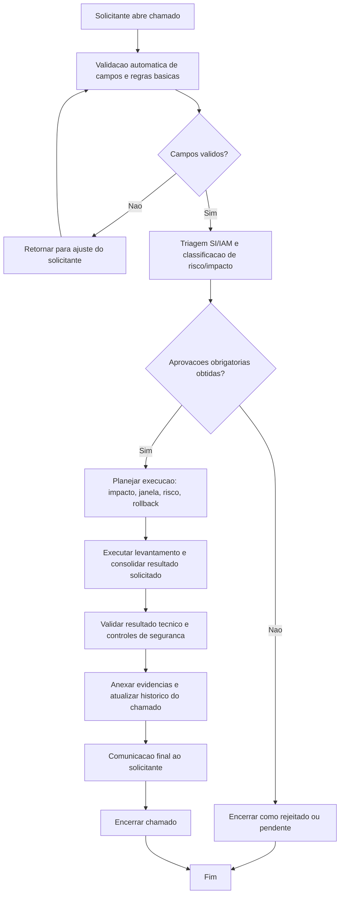

# BDSM - Levantamento de informacoes AWS (`info-create`)

- Categoria: Levantamento de Informacoes AWS
- Fonte funcional: [ADR_LEVANTAMENTO_INFORMACOES_AWS.md](../adr/ADR_LEVANTAMENTO_INFORMACOES_AWS.md)

## 1. Objetivo do processo
Definir o fluxo proposto de execucao do chamado `info-create` com controles de qualidade, governanca, seguranca e rastreabilidade.

## 2. Entradas do processo
### 2.1 Prerequisitos
- Objetivo do levantamento definido
- Descricao do levantamento informada
- Resultado esperado claro

### 2.2 Campos obrigatorios da tela
- Descricao do levantamento
- Justificativa do levantamento

### 2.3 Campos opcionais da tela
- Comentarios
- Upload de Anexos (opcional)

### 2.4 Documentos/evidencias esperadas
- Descricao do levantamento
- Anexos de apoio (quando houver)

## 3. BDSM do processo proposto

## 4. Gates de controle para execucao
| Gate | Verificacao obrigatoria | Referencia da tela |
| --- | --- | --- |
| Gate 1 - Intake | Campos obrigatorios preenchidos | Descricao do levantamento; Justificativa do levantamento |
| Gate 2 - Qualidade | Validacoes obrigatorias satisfeitas | Descricao do levantamento obrigatoria; Justificativa obrigatoria |
| Gate 3 - Governanca | Aprovacoes registradas | Gestor solicitante; Seguranca Cloud; Governanca Cloud |
| Gate 4 - Execucao | Executar levantamento e consolidar resultado solicitado | A solicitacao pode cobrir dump amplo (ex.: todas as roles/policies/recursos) ou alvo especifico.; O conteudo do levantamento e informado em texto livre para reduzir friccao de abertura.; No mesmo campo, o solicitante pode combinar escopo amplo e alvos especificos. |
| Gate 5 - Encerramento | Evidencias anexadas e comunicacao de conclusao | Historico do chamado atualizado + anexos + resultado final |

## 5. Boas praticas aplicaveis
- Executar validacao de completude e consistencia antes de iniciar qualquer acao tecnica.
- Aplicar principio do menor privilegio e segregacao de funcao durante aprovacao e execucao.
- Registrar evidencias tecnicas no chamado (logs, IDs, prints, diffs ou anexos).
- Atualizar status do chamado por etapa para manter rastreabilidade operacional.
- Planejar rollback e janela de mudanca quando houver risco de impacto em producao.
- Realizar validacao funcional/tecnica apos execucao antes de encerrar o chamado.
- Garantir integridade dos dados coletados e registrar origem/periodo de referencia.
- Entregar resultado em formato rastreavel e reproduzivel para auditoria futura.

## 6. Regras especificas da tela
- A solicitacao pode cobrir dump amplo (ex.: todas as roles/policies/recursos) ou alvo especifico.
- O conteudo do levantamento e informado em texto livre para reduzir friccao de abertura.
- No mesmo campo, o solicitante pode combinar escopo amplo e alvos especificos.

## 7. Criterios de conclusao
- Todas as validacoes obrigatorias atendidas.
- Aprovacoes registradas conforme cadeia da categoria.
- Execucao tecnica concluida sem pendencias abertas.
- Evidencias anexadas e comunicacao final registrada no chamado.
