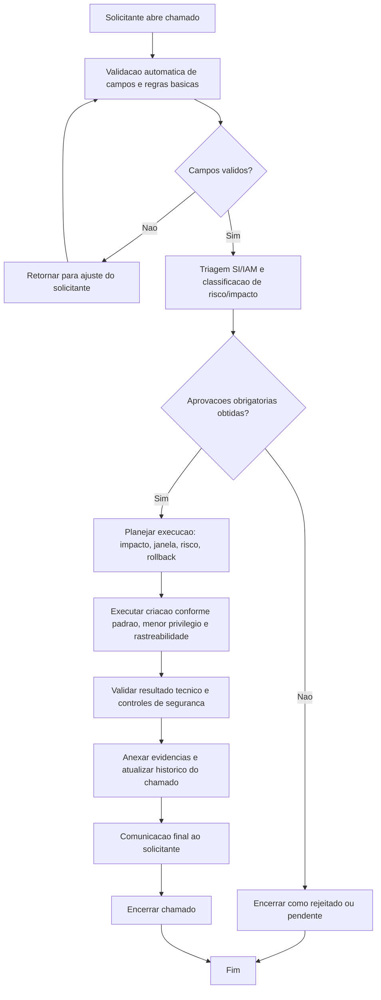

# BDSM - Criacao de policy (`policy-create`)

- Categoria: Policy AWS
- Fonte funcional: [ADR_CRIACAO_POLICY_AWS.md](../adr/ADR_CRIACAO_POLICY_AWS.md)

## 1. Objetivo do processo
Definir o fluxo proposto de execucao do chamado `policy-create` com controles de qualidade, governanca, seguranca e rastreabilidade.

## 2. Entradas do processo
### 2.1 Prerequisitos
- Conta ou OU alvo definida
- Owner tecnico identificado
- Escopo da policy detalhado

### 2.2 Campos obrigatorios da tela
- Conta AWS
- Nome da Policy (Taxonomia)
- Actions Necessarias
- Resources
- Justificativa

### 2.3 Campos opcionais da tela
- Conditions (opcional)
- Comentarios
- Upload de Anexos (opcional)

### 2.4 Documentos/evidencias esperadas
- Actions/Resources/Conditions esperados (create)
- JSON atual e JSON proposto (update/remove)
- Justificativa de negocio e risco
- Plano de rollback

## 3. BDSM do processo proposto

## 4. Gates de controle para execucao
| Gate | Verificacao obrigatoria | Referencia da tela |
| --- | --- | --- |
| Gate 1 - Intake | Campos obrigatorios preenchidos | Conta AWS; Nome da Policy (Taxonomia); Actions Necessarias; Resources; Justificativa |
| Gate 2 - Qualidade | Validacoes obrigatorias satisfeitas | Acoes e resources devem ser informados no create; Sem wildcard critico sem justificativa; Change window para producao; Alteracao/remocao deve manter menor privilegio e plano de rollback |
| Gate 3 - Governanca | Aprovacoes registradas | Gestor solicitante; Seguranca Cloud; IAM Admin; Governanca Cloud |
| Gate 4 - Execucao | Executar criacao conforme padrao, menor privilegio e rastreabilidade | Tipo de policy e implicito no create: IAM Managed Policy (sem campo na tela).; No create, o solicitante informa Actions, Resources e Conditions (se houver), sem montar JSON manual.; No campo Resources, o solicitante deve informar o nome exato do recurso (nao descricao em texto livre) ou ARN.; Naming segue AWS_PL_{NOME_DA_POLICY}_{PRD|HML|DEV}. |
| Gate 5 - Encerramento | Evidencias anexadas e comunicacao de conclusao | Historico do chamado atualizado + anexos + resultado final |

## 5. Boas praticas aplicaveis
- Executar validacao de completude e consistencia antes de iniciar qualquer acao tecnica.
- Aplicar principio do menor privilegio e segregacao de funcao durante aprovacao e execucao.
- Registrar evidencias tecnicas no chamado (logs, IDs, prints, diffs ou anexos).
- Atualizar status do chamado por etapa para manter rastreabilidade operacional.
- Planejar rollback e janela de mudanca quando houver risco de impacto em producao.
- Realizar validacao funcional/tecnica apos execucao antes de encerrar o chamado.

## 6. Regras especificas da tela
- Tipo de policy e implicito no create: IAM Managed Policy (sem campo na tela).
- No create, o solicitante informa Actions, Resources e Conditions (se houver), sem montar JSON manual.
- No campo Resources, o solicitante deve informar o nome exato do recurso (nao descricao em texto livre) ou ARN.
- Naming segue AWS_PL_{NOME_DA_POLICY}_{PRD|HML|DEV}.

## 7. Criterios de conclusao
- Todas as validacoes obrigatorias atendidas.
- Aprovacoes registradas conforme cadeia da categoria.
- Execucao tecnica concluida sem pendencias abertas.
- Evidencias anexadas e comunicacao final registrada no chamado.
