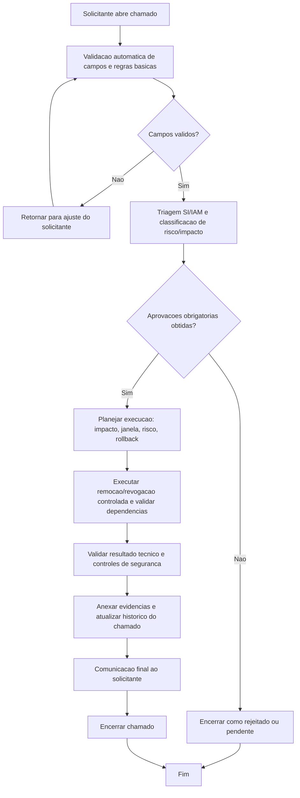

# BDSM - Remocao de policy (`policy-delete`)

- Categoria: Policy AWS
- Fonte funcional: [ADR_REMOCAO_POLICY_AWS.md](../adr/ADR_REMOCAO_POLICY_AWS.md)

## 1. Objetivo do processo
Definir o fluxo proposto de execucao do chamado `policy-delete` com controles de qualidade, governanca, seguranca e rastreabilidade.

## 2. Entradas do processo
### 2.1 Prerequisitos
- Conta ou OU alvo definida
- Owner tecnico identificado
- Escopo da policy detalhado

### 2.2 Campos obrigatorios da tela
- Conta AWS
- Policy Alvo (nome/ARN)
- Plano de Remocao e Reversao
- Justificativa

### 2.3 Campos opcionais da tela
- Comentarios
- Upload de Anexos (opcional)

### 2.4 Documentos/evidencias esperadas
- Actions/Resources/Conditions esperados (create)
- JSON atual e JSON proposto (update/remove)
- Justificativa de negocio e risco
- Plano de rollback

## 3. BDSM do processo proposto

## 4. Gates de controle para execucao
| Gate | Verificacao obrigatoria | Referencia da tela |
| --- | --- | --- |
| Gate 1 - Intake | Campos obrigatorios preenchidos | Conta AWS; Policy Alvo (nome/ARN); Plano de Remocao e Reversao; Justificativa |
| Gate 2 - Qualidade | Validacoes obrigatorias satisfeitas | Acoes e resources devem ser informados no create; Sem wildcard critico sem justificativa; Change window para producao; Alteracao/remocao deve manter menor privilegio e plano de rollback |
| Gate 3 - Governanca | Aprovacoes registradas | Gestor solicitante; Seguranca Cloud; IAM Admin; Governanca Cloud |
| Gate 4 - Execucao | Executar remocao/revogacao controlada e validar dependencias | Fluxo cobre somente IAM Managed Policy (tipo implicito, sem selecao).; Atualizar entidades dependentes antes da exclusao. |
| Gate 5 - Encerramento | Evidencias anexadas e comunicacao de conclusao | Historico do chamado atualizado + anexos + resultado final |

## 5. Boas praticas aplicaveis
- Executar validacao de completude e consistencia antes de iniciar qualquer acao tecnica.
- Aplicar principio do menor privilegio e segregacao de funcao durante aprovacao e execucao.
- Registrar evidencias tecnicas no chamado (logs, IDs, prints, diffs ou anexos).
- Atualizar status do chamado por etapa para manter rastreabilidade operacional.
- Confirmar dependencias e impacto antes da remocao/revogacao definitiva.
- Executar desativacao gradativa quando aplicavel para reduzir risco operacional.

## 6. Regras especificas da tela
- Fluxo cobre somente IAM Managed Policy (tipo implicito, sem selecao).
- Atualizar entidades dependentes antes da exclusao.

## 7. Criterios de conclusao
- Todas as validacoes obrigatorias atendidas.
- Aprovacoes registradas conforme cadeia da categoria.
- Execucao tecnica concluida sem pendencias abertas.
- Evidencias anexadas e comunicacao final registrada no chamado.
