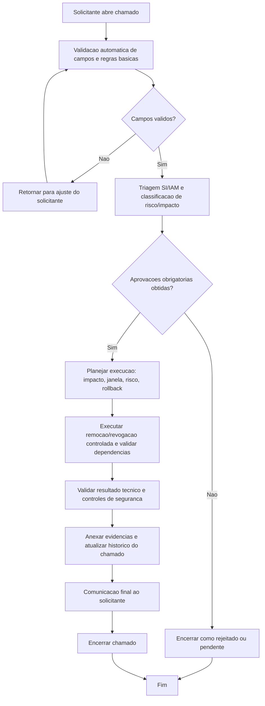

# BDSM - Remocao de role (`role-delete`)

- Categoria: Role AWS
- Fonte funcional: [ADR_REMOCAO_ROLE_AWS.md](../adr/ADR_REMOCAO_ROLE_AWS.md)

## 1. Objetivo do processo
Definir o fluxo proposto de execucao do chamado `role-delete` com controles de qualidade, governanca, seguranca e rastreabilidade.

## 2. Entradas do processo
### 2.1 Prerequisitos
- Conta AWS ativa
- Role alvo ou nome padronizado definido conforme acao

### 2.2 Campos obrigatorios da tela
- Conta AWS
- Role alvo para remocao
- Justificativa

### 2.3 Campos opcionais da tela
- Comentarios
- Upload de Anexos (opcional)

### 2.4 Documentos/evidencias esperadas
- Justificativa de menor privilegio
- Evidencias tecnicas da alteracao/remocao quando aplicavel

## 3. BDSM do processo proposto

## 4. Gates de controle para execucao
| Gate | Verificacao obrigatoria | Referencia da tela |
| --- | --- | --- |
| Gate 1 - Intake | Campos obrigatorios preenchidos | Conta AWS; Role alvo para remocao; Justificativa |
| Gate 2 - Qualidade | Validacoes obrigatorias satisfeitas | Escopo por conta AWS obrigatorio; Nome padronizado obrigatorio no create; Role alvo obrigatoria no update/delete; Acoes de alteracao obrigatorias no role-update; Policy JSON valido quando anexado |
| Gate 3 - Governanca | Aprovacoes registradas | Gestor solicitante; Seguranca Cloud; IAM Admin |
| Gate 4 - Execucao | Executar remocao/revogacao controlada e validar dependencias | Informar role em nome livre ou ARN.; Validar dependencias e rollback antes da remocao. |
| Gate 5 - Encerramento | Evidencias anexadas e comunicacao de conclusao | Historico do chamado atualizado + anexos + resultado final |

## 5. Boas praticas aplicaveis
- Executar validacao de completude e consistencia antes de iniciar qualquer acao tecnica.
- Aplicar principio do menor privilegio e segregacao de funcao durante aprovacao e execucao.
- Registrar evidencias tecnicas no chamado (logs, IDs, prints, diffs ou anexos).
- Atualizar status do chamado por etapa para manter rastreabilidade operacional.
- Confirmar dependencias e impacto antes da remocao/revogacao definitiva.
- Executar desativacao gradativa quando aplicavel para reduzir risco operacional.

## 6. Regras especificas da tela
- Informar role em nome livre ou ARN.
- Validar dependencias e rollback antes da remocao.

## 7. Criterios de conclusao
- Todas as validacoes obrigatorias atendidas.
- Aprovacoes registradas conforme cadeia da categoria.
- Execucao tecnica concluida sem pendencias abertas.
- Evidencias anexadas e comunicacao final registrada no chamado.
